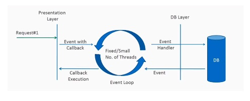
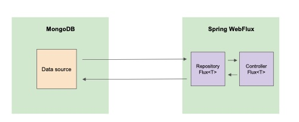

# Spring MongoDB Reference Project
> *This repository aims to provide the Reference project spring boot webflux and reactive mongodb*
*Here was change the simple spring mvc project into a mvc webflux arquiteture*

### Spring WebFlux Model


### Container Docker do MongoDB for developing
```
docker run -d -p 27017:27017 -v /data/db --name mongo1 mongo:4.4.3-bionic
```

```
docker exec -it mongo1 bash
```

### Interace to work with Mongo
>  *MongoDB Compass* 

## Postman Collection and Environment:
(download from the main folder of this repository, then import it into your Postman)

```
host: http://localhost:8080
```

## Domain Model


## Includes
The following features are preconfigured.

### Features
- Find users
- Find users by id
- Insert new user
- Update user
- Delete user
- Find user posts
- Find posts by id
- Search posts by title
- Search posts using multiple criteria
